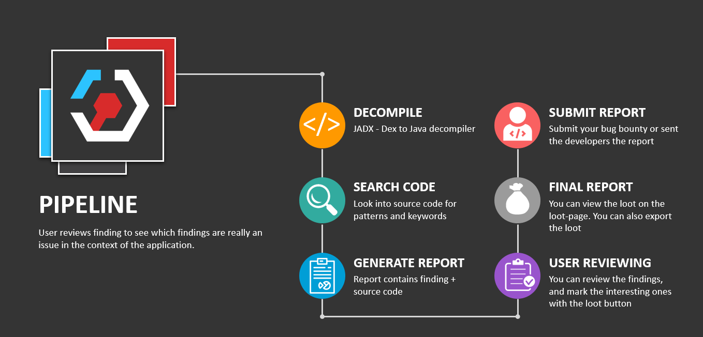

# StaCoAn    

StaCoAn is a __crossplatform__ tool which aids developers, bugbounty hunters and ethical hackers performing [static code analysis](https://en.wikipedia.org/wiki/Static_program_analysis) on mobile applications\*.

This tool will look for interesting lines in the code which can contain:
* Hardcoded credentials
* API keys
* URL's of API's
* Decryption keys
* Major coding mistakes

This tool was created with a big focus on usability and graphical guidance in the user interface.

For the impatient ones, grab the download on the [releases page](https://github.com/vincentcox/StaCoAn/releases).

<p style="font-size: 0.6em">
&ast;: note that currently only apk files are supported, but ipa files will follow very shortly.
</p>

An example report can be found [here](https://github.com/vincentcox/StaCoAn/raw/master/resources/example-report.zip).


## Table of Contents
<!-- TOC depthFrom:2 depthTo:6 withLinks:1 updateOnSave:1 orderedList:0 -->

- [Table of Contents](#table-of-contents)
- [Features](#features)
	- [Looting concept](#looting-concept)
	- [Wordlists](#wordlists)
	- [Filetypes](#filetypes)
	- [Responsive Design](#responsive-design)
- [Limitations](#limitations)
- [Getting Started](#getting-started)
	- [From the releases](#from-the-releases)
	- [Docker](#docker)
	- [From source](#from-source)
	- [Building the executable](#building-the-executable)
		- [Windows](#windows)
		- [mac](#mac)
		- [Linux](#linux)
- [Contributing](#contributing)
	- [Roadmap](#roadmap)
- [Authors & Contributors](#authors-contributors)
	- [Top contributors](#top-contributors)
- [License](#license)
- [Acknowledgments](#acknowledgments)

<!-- /TOC -->

## Features
The concept is that you drag and drop your mobile application file (an .apk or .ipa file) on the StaCoAn application and it will generate a visual and portable report for you. You can tweak the settings and wordlists to get a customized experience.

The reports contain a handy tree viewer so you can easily browse trough your decompiled application.


### Looting concept
The _Loot Function_ let you 'loot' (~bookmark) the findings which are of value for you and on the loot-page you will get an overview of your 'loot' raid.

The final report can be exported to a zip file and shared with other people.

### Wordlists
The application uses wordlists for finding interesting lines in the code.
Wordlists are in the following format:
```
API_KEY|||80||| This contains an API key reference
(https|http):\/\/.*api.*|||60||| This regex matches any URL containing 'api'
```
__Note that these wordlists support [regex](https://www.regular-expressions.info/examples.html) entries.__

In the `exclusion_list.txt` you can define exclusions (if you have for some reason to much findings):
```
(https|http):\/\/.*api.*|||"res","layout"||| Like previously, note that "res","layout" resembles the path
(https|http):\/\/.*api.*|||||| To exclude everywhere
```

### Filetypes
Any source file will be processed. This contains `'.java', '.js', '.html', '.xml',...` files.

Database-files are also searched for keywords. The database also has a table viewer.


### Responsive Design
The reports are made to fit on all screens.


## How does the tool works?



## Limitations
This tool will have trouble with [obfuscated](https://en.wikibooks.org/wiki/Introduction_to_Software_Engineering/Tools/Obfuscation) code. If you are a developer try to compile without obfuscation turned on before running this tool. If you are on the offensive side, good luck bro.

## Getting Started
### From the releases
If you want to get started as soon as possible, head over to the [releases page](https://github.com/vincentcox/StaCoAn/releases) and download the executable or archive which corresponds to your operating system.

If you have downloaded the release zip file, extract this.

On Windows you can just double click the executable. It will open in server mode and you can just drag and drop your mobile applications in the webinterface.


On Mac and Linux you can just run it from the terminal without arguments for the server-mode.
```
./stacoan
```
Drag and drop this file onto the executable.

Or you can specify an apk-file to run it without the server-mode:
```
./stacoan -p test-apk.apk
```
The report will be put inside a folder with a name corresponding to the apk.

### Docker

```
cd docker
```
```
docker build . -t stacoan
```
_Make sure that your application is at the location `/yourappsfolder`._

```
docker run -e JAVA_OPTS="-Xms2048m -Xmx2048m" -p 8888:8888 -p 7777:7777 -i -t stacoan
```

Drag and drop your application via: http://127.0.0.1:7777.


### From source
```
git clone https://github.com/vincentcox/StaCoAn/
```

```
cd StaCoAn/src
```

Make sure that you have pip3 installed:

```
sudo apt-get install python3-pip
```

Install the required python packages:

```
pip3 install -r requirements.txt
```

Run StaCoAn via commandline:

```
python3 stacoan.py -p yourApp.apk
```
__Or__ if you rather use the drag and drop interface:
```
python3 stacoan.py
```
### Building the executable
Make sure that you are in the `src` folder.
```
cd src
```
Install [PyInstaller](http://www.pyinstaller.org/):
```
pip3 install pyinstaller
```

#### Windows

PyInstaller can't handle subfolders with code, therefore we need to put the code in one folder.
```
sed -i 's/from helpers./from /g' helpers/*
sed -i 's/from helpers./from /g' stacoan.py
sed -i 's/os.path.join(parentdir, "config.ini")/"config.ini"/g' helpers/logger.py
cp helpers/* ./ || :;
```
Build stacoan:
```
python3 -m PyInstaller stacoan.py --onefile --icon icon.ico --name stacoan --clean
```

#### mac

PyInstaller can't handle subfolders with code, therefore we need to put the code in one folder.
```
# Note the ''-> this is because sed syntax is different on mac.
sed -i '' 's/from helpers./from /g' helpers/*
sed -i '' 's/from helpers./from /g' stacoan.py
sed -i '' 's/os.path.join(parentdir, "config.ini")/"config.ini"/g' helpers/logger.py
cp helpers/* ./ || :;
```
Build stacoan:
```
python3 -m PyInstaller stacoan.py --onefile --icon icon.ico --name stacoan --clean
```

#### Linux

PyInstaller can't handle subfolders with code, therefore we need to put the code in one folder.
```
sed -i 's/from helpers./from /g' helpers/*
sed -i 's/from helpers./from /g' stacoan.py
sed -i 's/os.path.join(parentdir, "config.ini")/"config.ini"/g' helpers/logger.py
cp helpers/* ./ || :;
```
Build stacoan:
```
python3 -m PyInstaller stacoan.py --onefile --icon icon.ico --name stacoan --clean
```

## Contributing
This entire program's value is depending on the wordlists it is using. In the end, the final result is what matters. It is easy to build a wordlist (in comparison to writing actual code), but it has the biggest impact on the end result. You can help the community the most with making wordlists.

If you want an easy way to post your idea's, head over to: http://www.tricider.com/brainstorming/2pdrT7ONVrB. From there you can add ideas for entries in the wordlist.

Improving the code is also much appreciated.

If the contribution is high enough, you will be mentioned in the `authors` section.

### Roadmap
- [ ] Make IPA files also work with this program
- [ ] Make DB matches loot-able
- [x] Better logging (cross platform)
- [x] Docker optimalisation
- [x] Use server to upload files (apk's, ipa's) and process them
- [x] Exception list for ignoring findings in certain folders. For example ignoring `http` in `res/layout` and in general `http://schemas.android.com/apk/res/android`
- [x] Make a cleaner file structure of this project

## Authors & Contributors

<table>
  <tr>
    <th><center>Project Creator</center></th>
  </tr>
  <tr>
    <td>
    <p align="center"></p>
    </td>
  </tr>
  <tr>
    <td>
      <div align="center">
        <a href="https://www.linkedin.com/in/ivincentcox/">
          
        </a>
        <a href="https://twitter.com/vincentcox_be">
          
        </a>
        <a href="https://vincentcox.com">
          
        </a>
      </div>
    </td>
  </tr>
</table>


### Top contributors

<a href="https://github.com/Kevin-De-Koninck"></a>
<a href="https://github.com/BBerastegui"></a>
<a href="https://github.com/adi0x90"></a>
<a href="https://github.com/Ayowel"></a>

## License
The following projects were used in this project:
* [Materialize CSS](http://materializecss.com/): Materialize, a CSS Framework based on Material Design. Used for the general theme of the reports.
* [PRISMJS](http://prismjs.com/): Lightweight, robust, elegant syntax highlighting. Used for the code markup
* [JADX](https://github.com/skylot/jadx): Dex to Java decompiler. Used for decompiling .apk files\*.
* [Fancytree](https://github.com/mar10/fancytree): jQuery tree view / tree grid plugin. Used in the tree-view of the reports.
* [fontawesome](http://fontawesome.io/): Font Awesome, the iconic font and CSS framework. Used for some icons.
* [JSZip](https://stuk.github.io/jszip/): JSZip is a javascript library for creating, reading and editing .zip files, with a lovely and simple API.
* [FileSaver](https://github.com/eligrey/FileSaver.js/): An HTML5 saveAs() FileSaver implementation.  Used in the JSZip library.

All of these projects have their corresponding licenses. Please respect these while you are modifying and redistributing this project.

<p style ="font-size: 0.6em">
&ast;: the binary is included in this project. If the dev's from JADX are not comfortable with this, feel free to contact me about this so we can find a solution.
</p>

## Acknowledgments
* [Kevin De Koninck](https://github.com/Kevin-De-Koninck): Git master and senpai of patience with my learning process in [pep8](https://www.python.org/dev/peps/pep-0008/).
* [brakke97](https://twitter.com/skeltavik): He taught me how to hack mobile applications. This project would never exist without him.
* [Aditya Gupta](https://twitter.com/adi1391): Awesome dude, really. Just keep him away from your IoT fridge or coffeemachine. Check out his [website](https://www.attify-store.com/) if you are into IoT hacking.
Also have a look at his course ["Advanced Android and iOS Hands-on Exploitation"](https://courses.securityschool.io/advanced-android-and-ios-hands-on-exploitation). I'm sure many future improvements in this tool will be based on ideas and techniques used during his course.
* [Quintenvi](https://twitter.com/quintenvi): He taught me alot, also non-hacking things.
* [c4b3rw0lf](https://twitter.com/c4b3rw0lf): The awesome dude behind the [VulnOS series](https://www.vulnhub.com/series/vulnos,36/).
* [MacJu89](https://twitter.com/MacJu89): infra & XSS senpai

Many more should be listed here, but I can't list them all.
